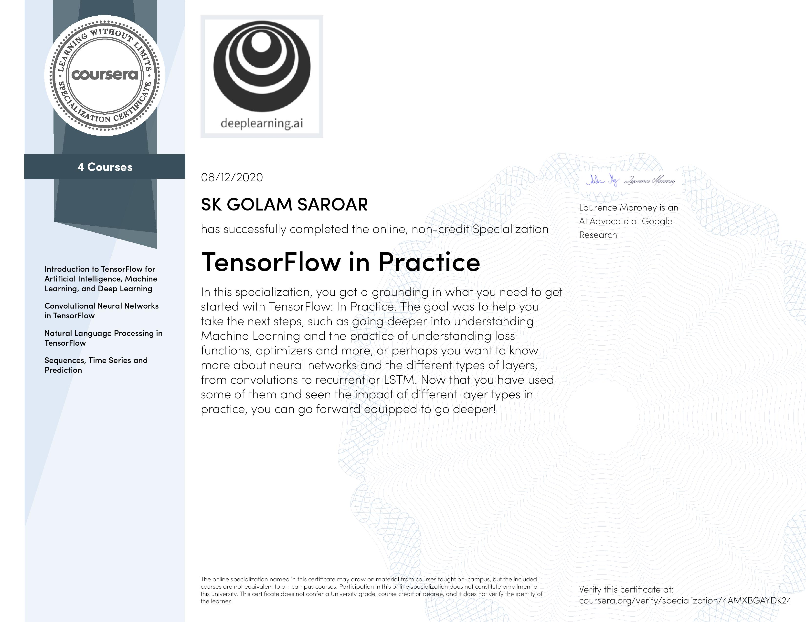

### Tensorflow in Practice Specialization on Coursera

This repository contains notebooks from the [Coursera](https://www.coursera.org/) specialization [TensorFlow in Practice](https://www.coursera.org/specializations/tensorflow-in-practice).

The specialization enables its learners to discover the tools software developers use to build scalable AI-powered algorithms in [TensorFlow](https://www.tensorflow.org/), a popular open-source machine learning framework.

There are four courses in the Specialization.

1. **Introduction to TensorFlow for Artificial Intelligence, Machine Learning, and Deep Learning**: Learn how to use TensorFlow to implement the most important and foundational principles of Machine Learning and Deep Learning so that you can start building and applying scalable models to real-world problems.

2. **Convolutional Neural Networks in TensorFlow**: Learn advanced techniques to improve computer vision models. Explore how to work with real-world images in different shapes and sizes, visualize the journey of an image through convolutions to understand how a computer “sees” information, plot loss and accuracy, and explore strategies to prevent overfitting, including augmentation and dropout. Also learn transfer learning and how learned features can be extracted from models.

3. **Natural Language Processing in TensorFlow**: Build natural language processing systems using TensorFlow. Learn to process text, including tokenizing and representing sentences as vectors, so that they can be input to a neural network. Also learn to apply RNNs, GRUs, and LSTMs in TensorFlow. Finally, train an LSTM on existing text to create original poetry!

4. **Sequences, Time Series and Prediction**: Learn how to build time series models in TensorFlow. Implement best practices to prepare time series data. Explore how RNNs and 1D ConvNets can be used for prediction. Finally, apply everything learned throughout the Specialization to build a sunspot prediction model using real-world data!

This is the certificate I recieved upon completing the Specialization.

This is the specialization description on Coursera website:

> In this four-course Specialization, you’ll explore exciting opportunities for AI applications. Begin by developing an understanding of how to build and train neural networks. Improve a network’s performance using convolutions as you train it to identify real-world images. You’ll teach machines to understand, analyze, and respond to human speech with natural language processing systems. Learn to process text, represent sentences as vectors, and input data to a neural network. You’ll even train an AI to create original poetry!